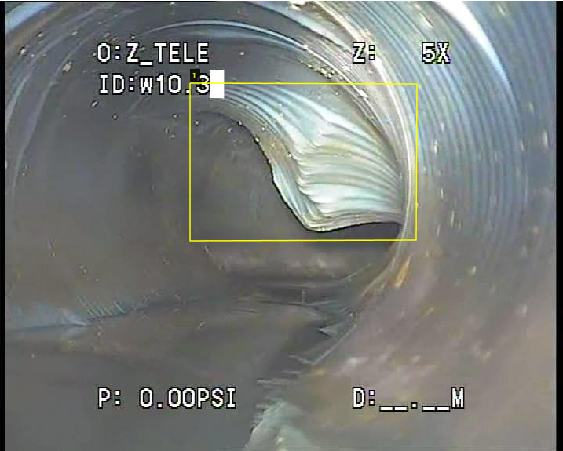

# Pipline Defect Semantic Segmentation

  
Этот репозиторий - мастерская для проведения экспериментов по семантической сегментации дефектов труб.

## О задаче


> **В двух словах**
> 
> Необходимо перейти от задачи детекции объектов к задаче семантической сегментации. Оригинальный датасет размеченный для задачи детекции находится по [ссылке](https://www.kaggle.com/datasets/simplexitypipeline/pipeline-defect-dataset).

Необходимо научить модель делать сегментацию изображений дефектов труб по очень грубому датасету, который мы составили из оригинального путём заливки боксов для детекции.

<p align="center">
  
  
  <i>Изображение деформации трубы с детекционным боксом и получившаяся маска</i>
</p>

Ссылка на новый [датасет](https://www.kaggle.com/datasets/caseyjohnsonrs/pipe-defect-box-semantic-segmentation).


Задача усложняется следующими факторами:
1. Некачественные данные - в оригинальном датасете были обнаружены дубликаты изображений и ложные детекционные боксы.
2. Размер датасета - разметить вручную за достаточно короткое время не предоставляется возможным.
3. 6 классов.

## Инструкция по настройке окружения


| Tool          | Version                             |
| ------------- | ----------------------------------- |
| Python        | Python 3.10                         |
| CUDA Toolkit  | 12.8                                |
| nvcc Compiler | 12.8.61                             |
| CUDA Build    | cuda_12.8.r12.8/compiler.35404655_0 |

  
Это окружение, под которым разрабатывался проект.
Установка CUDA не является обязательным шагом, но без него всё обучение будет проходить медленно.

  

**1. Создаём виртуальное окружение**

  

```bash

py -3.10 -m venv venv

```

  

**2. Активируем окружение**

  

Для Windows

  

```cmd

venv\Scripts\activate.bat

```

  

Для Linux

  

```bash

source venv/bin/activate

```

  

**3. Обновляем pip**

  

```bash

pip install --upgrade pip

```

  

**4. Устанавливаем зависимости**

  

```bash

pip install -r requirements.txt

```

  

**5. Ставим отдельно PyTorch**

  

С ним по-сложнее, может сразу не заработать. При текущей версии CUDA пришлось переустановить PyTorch:

  

```bash

pip uninstall -y torch torchvision torchaudio

pip install torch torchvision --index-url https://download.pytorch.org/whl/cu128

```

  

Проверьте версию установленной CUDA и сходите на [официальный сайт PyTorch](https://pytorch.org/get-started/locally/), чтобы скачать нужную версию библиотеки.

  

Чтобы проверить версию CUDA необходимо в командной строке выполнить:

  

```cmd

nvcc --version

```

  

**6. Создаём переменные окружения**

  

Создаём в корне проекта файл `.env` примерно с таким наполнением:


```bash

MLFLOW_TRACKING_URI=http://111.111.111.111:5001
EXPERIMENT_NAME="Pipeline Defects Detection"
MODELS_DIR=models
DATASETS_DIR=datasets
UNET_MODEL_PREFIX=unet_bss_
UNET_ATTENTION_MODEL_PREFIX=unet_attn_
USERNAME=Casey

```

  

**7. Проверяем, что всё работает**

Запускаем минимальный скрипт `scripts/tools/health_check.py`. Естественно, правильно ли вы настроили окружение полностью выяснится, когда перейдёте к экспериментам.

Готово!

## Как проводить эксперименты

Переходим в директорию `scripts/experiments`. В ней находятся директории под названиями экспериментов. Открываете интересующую и читаете `README.md`, который объясняет как запустить и как сконфигурировать.
